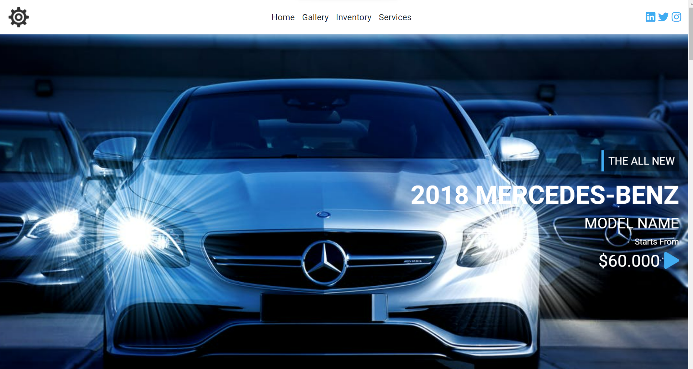
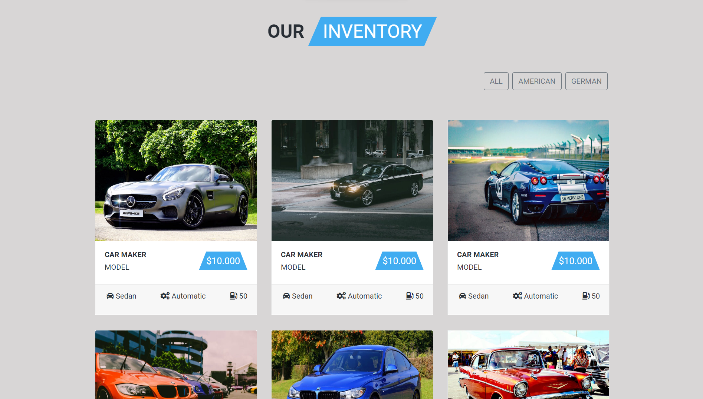

#App with Nodejs

https://github.com/TUANTA256/devops-capstone

This is a landing page website about shop car. Use html, css and java script.




## Folder Structure
- css, it's all the code for stype of app 
- images, it's all necessary image for app
- script, it's all event handling for app
- video, it's background for app

### Setup the Environment

* You can use a local machine or create a virtual environment by following these steps:
  - Create a virtual machine by EC2 service on AWS
  - Install python 2.7 (need to let cloud9 install the necessary packages when connecting to).
  - Install python 3.7 and nodejs with latest version (need to install packages for microservices).
  - Use cloud9 to connect to the virtual machine just created above to easily deploy and manage microservices.

* Create a virtualenv with Python 3.7 and activate it. Refer to this link for help on specifying the Python version in the virtualenv. 
```bash
python3 -m pip install --user virtualenv
# You should have Python 3.7 available in your host. 
# Check the Python path using `which python3`
# Use a command similar to this one:
python3 -m virtualenv --python=<path-to-Python3.7> .devops
source .devops/bin/activate
```
* Run `make install`
* Install docker
* Install jenkin
* Install kubectl 
* Install AWS cli (If you want to deploy your app on aws)

##### Running on eks


*Build anh push image
    - docker build .  -t ${DOCKER_IMAGE}:latest
    - docker tag ${DOCKER_IMAGE}:latest ${DOCKER_IMAGE}:${dockerTag}
    - docker push ${DOCKER_IMAGE}:${dockerTag}
    - docker push ${DOCKER_IMAGE}:latest

*Build app on kubernetes
    - chmod +x changeTag.sh
    - ./changeTag.sh ${dockerTag}
    - kubectl apply -f deployk8s
